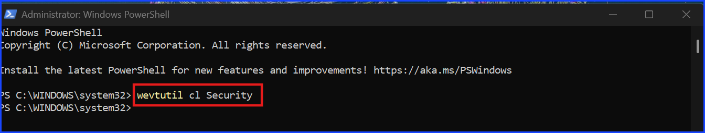
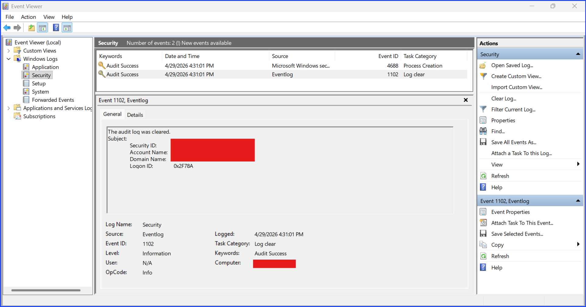
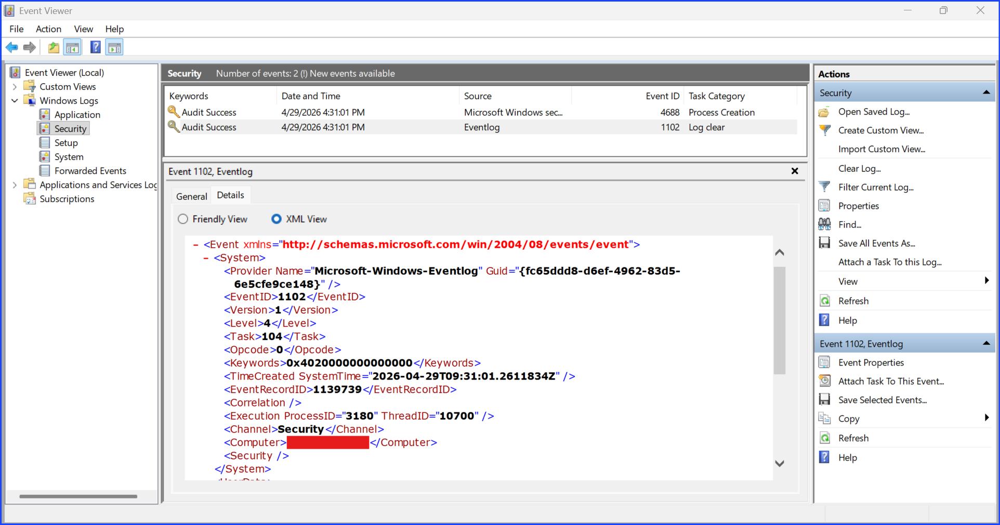
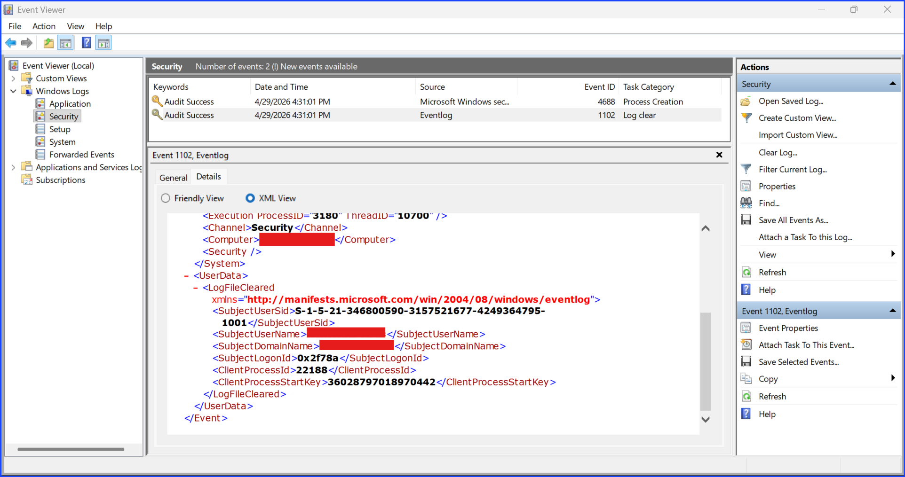
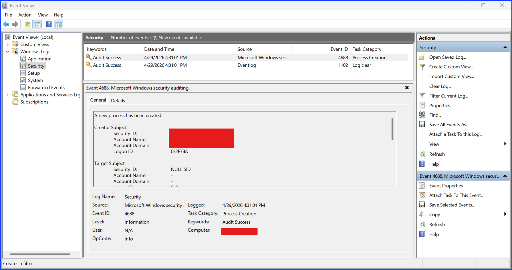
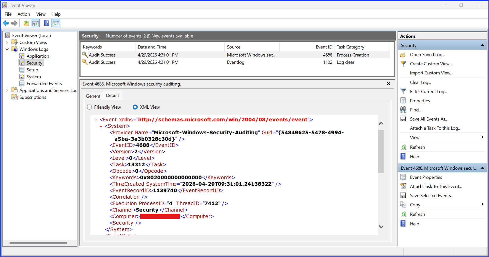
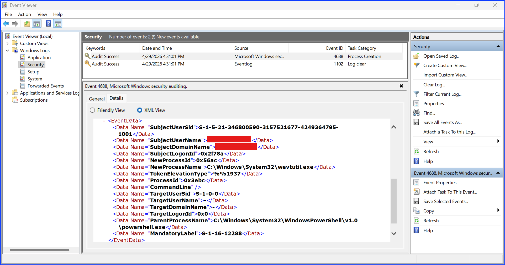

# Investigating Windows Event ID 1102 Security Log Was Cleared

## Context

This lab investigates when the security log was deleted on a Windows endpoint using Windows Event Viewer.

If performs by an unauthorized user, it is an important indicator that something happened. This shows that something is bad enough happened that the performer wanted to hide from the security professionals.

The focus of this investigation is Windows Event ID 1102, which records when a security log was clear.

Since there were only two events after the security record was wipe, I checked the other event, event ID 4688 Process Creation, and found the correlation between it and the security log wiped. The log wiped commanded was performed using PowerShell right before the log was deleted.

The objectives of this investigation are to:

+ To extract relevant information from the events records
+ To determine whether the activity represents a legitimate behavior performed by the authorized people or by an attacker.
+ To show a simple correlated event between Event ID 4688 and 1102.

Examples of good reasons why an authorized admin perform it are:

+ To reclaim the space on the computer when the log has taken up a lot of space.
+ It is a lab.

Examples of bad reasons why an attacker perform it:

+ To hide their data exfiltration attempt.
+ To hide their malware dropping which makes it more difficult for the security analyst to track and secure the system. If they don't know which application or file is infected with the malware, they will have to take time digging. By the time they find it, some damages may have already occured.

## Proof Of Concept

**Step 1.** Run `PowerShell.ps` as administrator.
**Step 2.** Type this command to wipe all the logs: `wevtutil cl Security`.

Fig 1. A PowerShell command clearing the log.

**Step 3.** Open `Windows Event Viewer` and search for the event ID `1102`.

Fig 2. Event Viewer General Tab

Fig 3. Event Viewer Details Tab XML View System

Fig 4. Event Viewer Details Tab XML View UserData

**Step 4.** Review event ID 1102 and extract the data details.

### Event ID 1102 Detail Extracted

| Field Name | Data |
| --- | --- |
| Event ID | 1102 |
| SubjectUserSid | |
| SubjectUserName | Redacted My Real Username |
| SubjectDomainName | Redacted My Real Domain Name |
| SubjectLogonID | |
| Time | |

**Step 5.** Since there was 2 events, check the correlated event 4688 as well.

Fig 5. Correlated Event ID 4688 General Tab

Fig 6. Correlated Event ID 4688 XML System

Fig 7. Correlated Event ID 4688 XML EventData

**Step 7.** Extracted the data from the correlated event ID 4688

### Event ID 4688 Detail Extracted

| Field Name | Data |
| --- | --- |
| Event ID | 1102 |
| SubjectUserSid | |
| SubjectUserName | Redacted My Real Username |
| SubjectDomainName | Redacted My Real Domain Name |
| SubjectLogonID | |
| Time | |

## Analysis

Taking a look at the data from the Event Viewer XML, the criteria for analysis are:

| Field Name | What it tells me? | Why it is an indicator? |
| --- | --- | --- |

### Inspecting The Event ID

### Correlated With The Event ID 4688

This event ID 4688 referred to a process creation process. In this event, it was shown that the data wipe command was performed on PowerShell before the data got wiped.

## Conclusion

This log wiped is performed by me, the authorized admin of my computer for this lab as explained in the Analysis section. This is a legitimate action. There is no trace of attackers.

## Recommendation

+ Set up an alert when this event is performed.
+ Follow the least privilege rule. Do not give authorization power to any users who should not have.
+ Communicate with the point of contact or the authorized admin if the action is performed by them if you are unsured even if the account who perform this action is an authorized account. An authorized account can be compromised as well especially when the action time is from unusual hours.

## MITRE ATT&CK Reference

---

CEU Submission Info

**Author:** Sangsongthong Chantaranothai  
**Blog Title:** Investigating Windows Event ID 1102 Security Log Was Cleared
**Blog URL:**
**Date Published:**  
