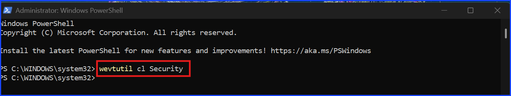
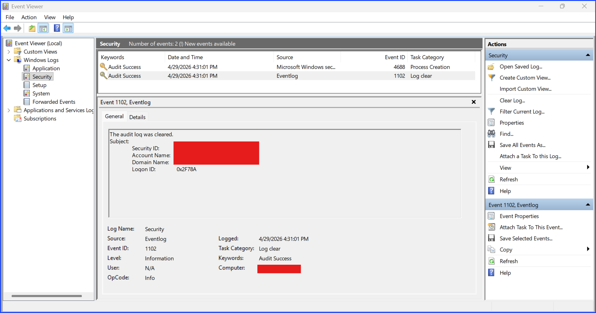
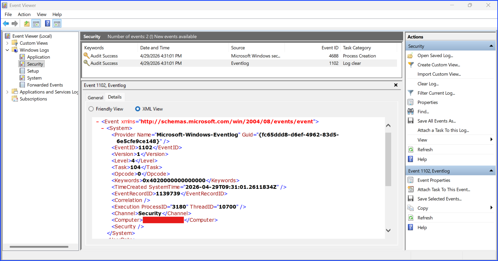
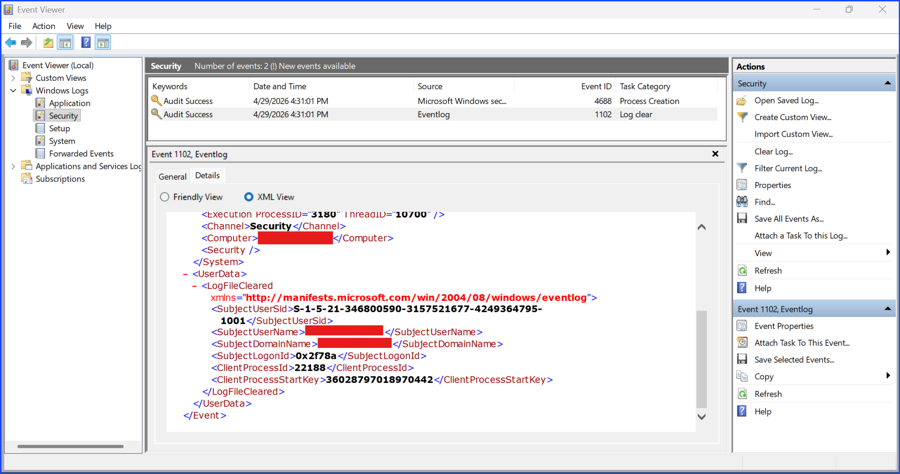
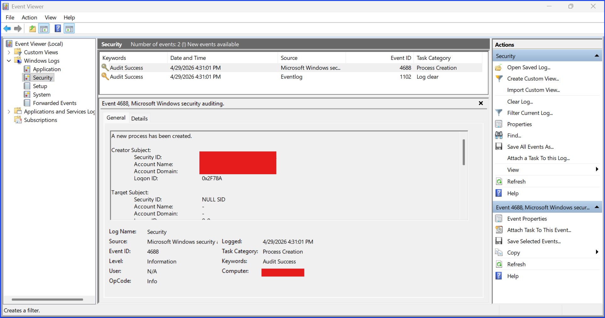
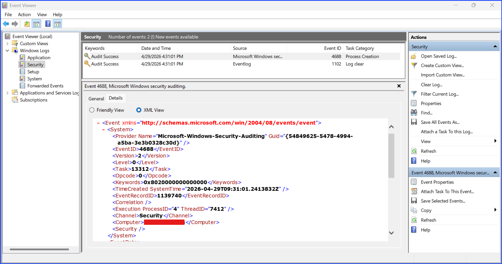
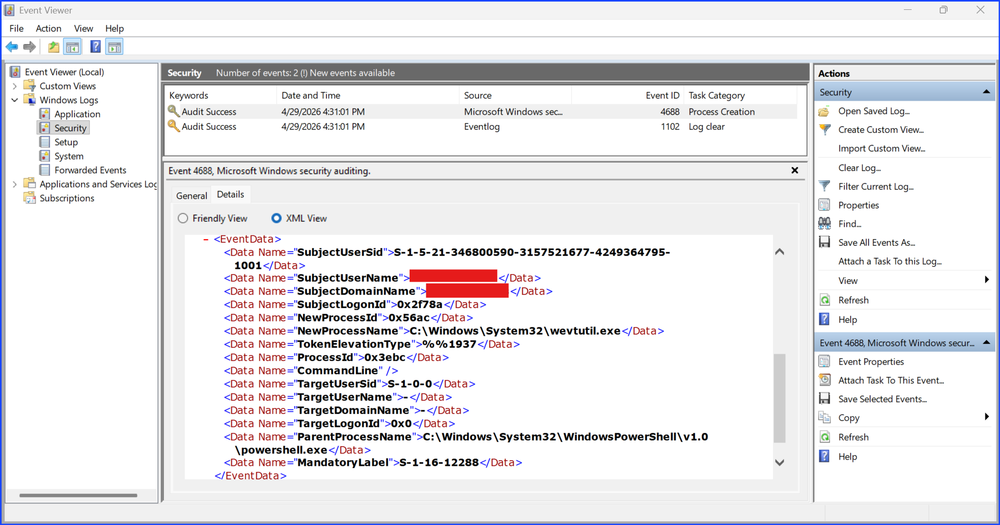

# Investigating Windows Event ID 1102 Security Log Was Cleared

## Context

Clearing the Windows Security log removes records that may be needed to determine what happened on the system. If the action cannot immediately be connected to authorized administration, maintenance, or testing, it is serious enough to treat as possible evidence destruction until a legitimate reason is confirmed.

Event ID 1102 does not automatically prove that an attack occurred. However, it should trigger an investigation into who cleared the log, why it was cleared, and what activity occurred beforehand. Microsoft classifies Event ID 1102 as having medium-to-high importance for security monitoring.

There are legitimate reasons for an authorized administrator to manually clear the Security log.

One example is when the Security log has reached its configured maximum size while its retention policy is set to **Do not overwrite events**. In this situation, Windows may be unable to continue recording new security events. An authorized administrator may preserve or archive the existing log and then clear it so Windows can resume recording new events.

Another legitimate reason is to reset an authorized staging, sandbox, or validation environment used to test a new security policy, audit configuration, logging structure, or system change before it is introduced into production. Clearing the previous events can provide a clean baseline for evaluating only the activity generated under the new configuration.

A personal learning or training lab is a separate use case. In that environment, the log may be cleared to isolate newly generated events, reproduce specific activity, or make the resulting evidence easier to analyze. This should not be confused with a production-relevant staging environment used to validate changes before deployment.

A technically defensible manual-clearing scenario is one in which:

1. The log is full or causing an operational problem.
2. Existing events are preserved, exported, or archived when they may still be needed.
3. An authorized administrator performs the clearing.
4. The reason, authorization, and time of the action are documented.

Depending on the configured retention policy, Windows may overwrite older events or automatically archive a full log. Manual clearing is therefore not always necessary and should not be treated as a routine action without a documented reason.

Potentially malicious reasons for clearing the Security log include:

+ Hiding evidence of an attempted or successful data exfiltration.
+ Hiding malware execution or files dropped onto the system.
+ Removing records that could help a security analyst reconstruct earlier activity.
+ Delaying an investigation by forcing the analyst to search for evidence through other logs and data sources.

This investigation was performed directly on a standalone Windows 11 Home endpoint using Windows Event Viewer and the logging functions built into Windows. The system was not connected to Active Directory, and no SIEM was used. The investigation therefore focuses on evidence available directly from a non-domain-joined Windows endpoint.

I attempted to enable command-line recording for process-creation events, but the **Process Command Line** field remained empty. Microsoft lists the **Include command line in process creation events** policy as supported on Windows Pro, Enterprise, Education, and IoT Enterprise editions, but not Windows Home. Windows 11 Home was therefore treated as the likely limitation in this investigation.

Event ID 4688 could still show that `wevtutil.exe` was launched by `powershell.exe`, but it could not display the complete PowerShell command and its arguments. The process relationship was therefore recorded, while the exact command line could not be confirmed from Event ID 4688 alone.

After the Security log was cleared, only two events were present in the log: Event ID 4688 and Event ID 1102. Event ID 4688 recorded the creation of `wevtutil.exe` with `powershell.exe` as its parent process immediately before Event ID 1102 recorded that the Security log had been cleared.

The objectives of this investigation are to:

+ Extract relevant information from Event IDs 1102 and 4688.
+ Correlate the process-creation event with the clearing of the Security log.
+ Determine whether the activity was performed by an authorized person or may represent unauthorized activity.
+ Identify the evidence and limitations available when investigating the activity directly through Windows Event Viewer.

## Proof Of Concept

**Step 1.** Run `PowerShell.ps` as administrator.
**Step 2.** Type this command to wipe all the logs: `wevtutil cl Security`.

Fig 1. A PowerShell command clearing the log.

**Step 3.** Open `Windows Event Viewer` and search for the event ID `1102`.

Fig 2. Event Viewer General Tab

Fig 3. Event Viewer Details Tab XML View System

Fig 4. Event Viewer Details Tab XML View UserData

**Step 4.** Review event ID 1102 and extract the data details.

### Event ID 1102 Detail Extracted

| Field Name | Data |
| --- | --- |
| Event ID | 1102 |
| SubjectUserSid | |
| SubjectUserName | Redacted My Real Username |
| SubjectDomainName | Redacted My Real Domain Name |
| SubjectLogonID | |
| Time | |

**Step 5.** Since there was 2 events, check the correlated event 4688 as well.

Fig 5. Correlated Event ID 4688 General Tab

Fig 6. Correlated Event ID 4688 XML System

Fig 7. Correlated Event ID 4688 XML EventData

**Step 7.** Extracted the data from the correlated event ID 4688

### Event ID 4688 Detail Extracted

| Field Name | Data |
| --- | --- |
| Event ID | 1102 |
| SubjectUserSid | |
| SubjectUserName | Redacted My Real Username |
| SubjectDomainName | Redacted My Real Domain Name |
| SubjectLogonID | |
| Time | |

## Analysis

Taking a look at the data from the Event Viewer XML, the criteria for analysis are:

| Field Name | What it tells me? | Why it is an indicator? |
| --- | --- | --- |

### Inspecting The Event ID

### Correlated With The Event ID 4688

This event ID 4688 referred to a process creation process. In this event, it was shown that the data wipe command was performed on PowerShell before the data got wiped.

## Conclusion

This log wiped is performed by me, the authorized admin of my computer for this lab as explained in the Analysis section. This is a legitimate action. There is no trace of attackers.

## Recommendation

+ Set up an alert when this event is performed.
+ Follow the least privilege rule. Do not give authorization power to any users who should not have.
+ Communicate with the point of contact or the authorized admin if the action is performed by them if you are unsured even if the account who perform this action is an authorized account. An authorized account can be compromised as well especially when the action time is from unusual hours.

## MITRE ATT&CK Reference

---

## CEU Submission Info

**Author:** Sangsongthong Chantaranothai  
**Blog Title:** Investigating Windows Event ID 1102 Security Log Was Cleared
**Blog URL:**
**Date Published:**  
