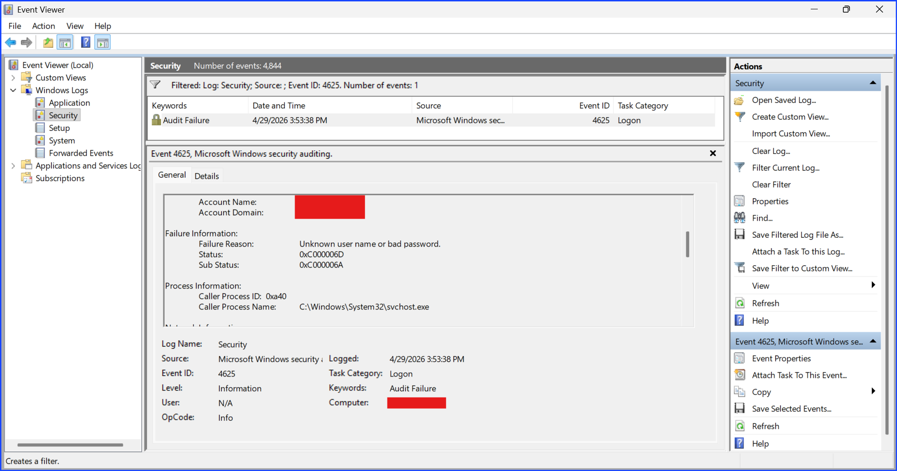
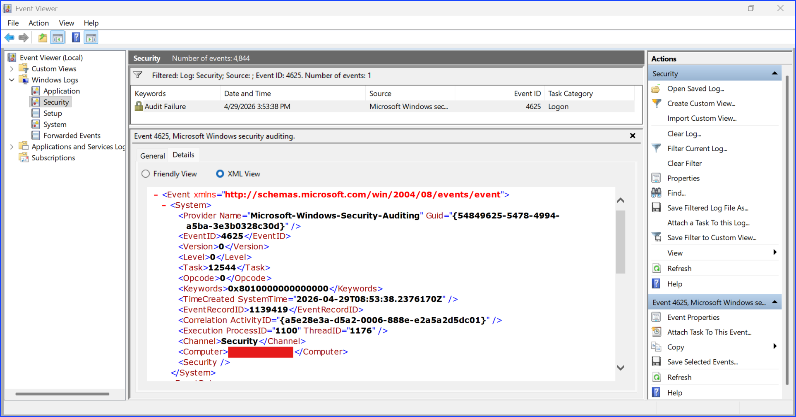
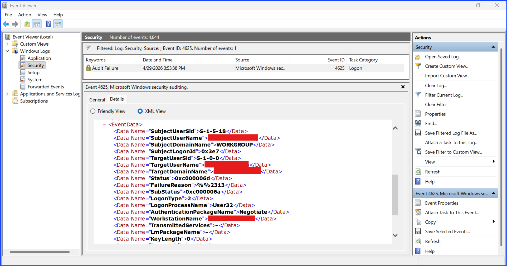
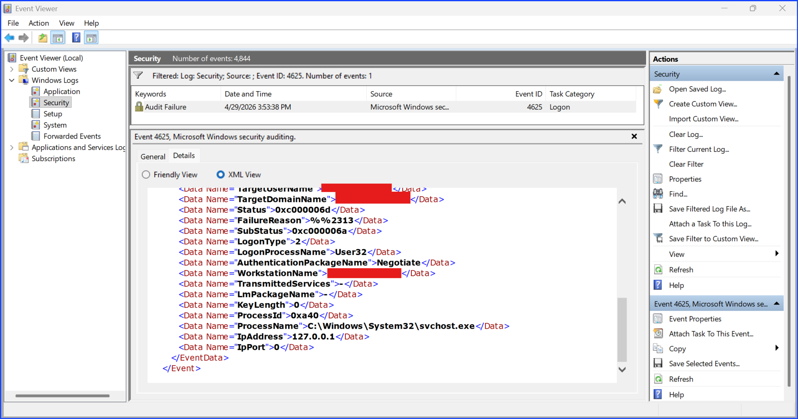
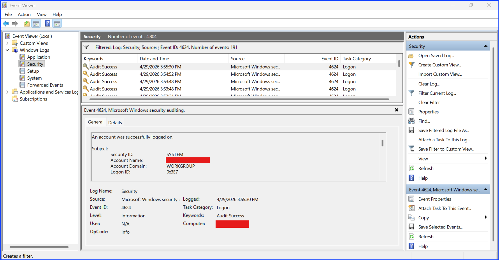
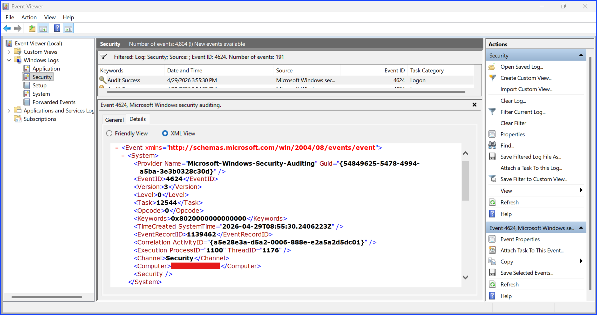
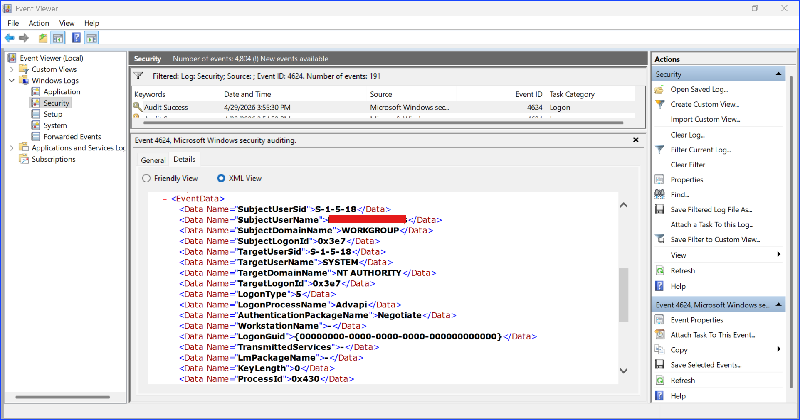

# Investigating Windows Event ID 4624/4625 Success/Failed Logon Attempt

## Context

This lab investigates a login success or failure on a Windows endpoint using Windows Event Viewer.

Logon success or failure are important from a security perspective because a multiple logon failure such as 500 times and follow by 1 success means there is brute force or dictionary attack attempts by an attacker. If the failure rate is very little such as a few attempts, it might indicate a normal user typo or forget their credentials. In addition, the time and the frequency of the event matter as well.

The focus of this investigation are Windows Event ID 4624 which is logon success and 4625 which is logon failure.

The objectives of this investigation are to:

+ identify a trace of login failure.
+ extract relevant information from the event record.
+ determine whether the activity represents a legitimate behavior performed by the authorized people or by an attacker.

## Proof Of Concept

**Step 1.** Log out from my computer.
**Step 2.** Log back in but intentionally typing the wrong password. This will trigger 1 logon failure event ID 4625.

Fig 1. Event ID 4625 General Tab

Fig 2. Event ID 4625 XML View System

Fig 3. Event ID 4625 XML View EventData 1

Fig 4. Event ID 4625 XML View EventData 2

**Step 3.** Log back in but type the correct password. This will trigger 1 logon success event ID 4624.

Fig 5. Event ID 4624 General Tab

Fig 6. Event ID 4625 XML View System

Fig 7. Event ID 4625 XML View EventData 1

Fig 8. Event ID 4625 XML View EventData 2

**Step 4.** Review and extract the data details.

### Event ID 4625 Logon Failure Detail Extracted

| Field Name | Data |
| --- | --- |
| Event ID | 4625 |
| SubjectUserSid | |
| SubjectUserName | Redacted My Real Username |
| SubjectDomainName | Redacted My Real Domain Name |
| SubjectLogonID | |
| Time | |

### Event ID 4624 Logon Success Detail Extracted

| Field Name | Data |
| --- | --- |
| Event ID | 4624 |
| SubjectUserSid | |
| SubjectUserName | Redacted My Real Username |
| SubjectDomainName | Redacted My Real Domain Name |
| SubjectLogonID | |
| Time | |

## Analysis

## Conclusion

## Recommendation

+ Set how many time a login failure is acceptable for your organization if your system allows before the account log down and the user has to contact the IT to prevent brute force or dictionary attack.
+ For an individual computer, make sure to set up multiple ways to login such as alternative emails or security questions.
+ Setup MFA. Even if the attacker can login, MFA will be another obsticle for them. Don't make it easy for them.

## MITRE ATT&CK Reference

---

CEU Submission Info

**Author:** Sangsongthong Chantaranothai  
**Blog Title:** Investigating Windows Event ID 4624/4625 Success/Failed Logon Attempt
**Blog URL:**
**Date Published:**  
