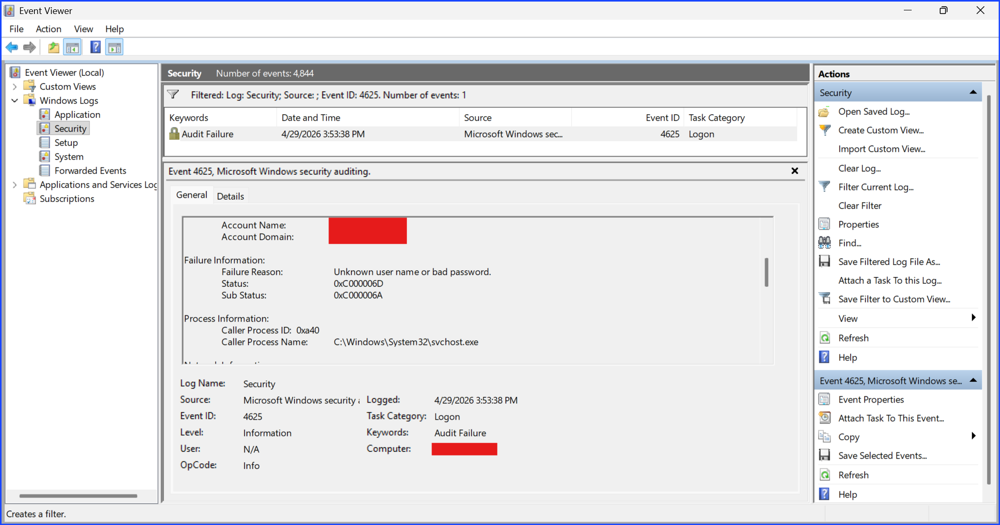
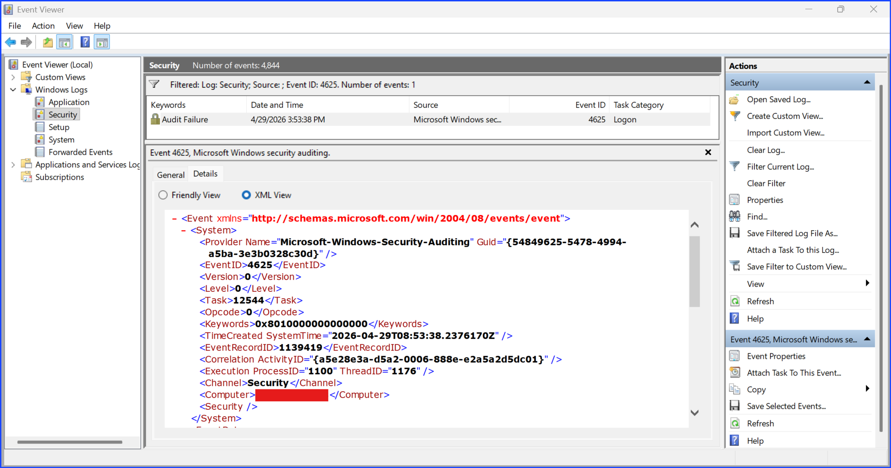
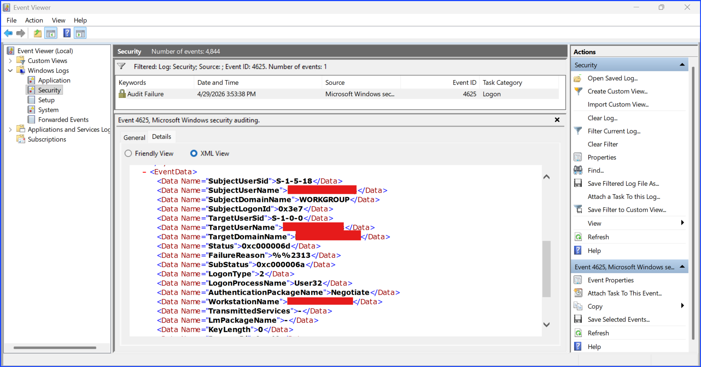
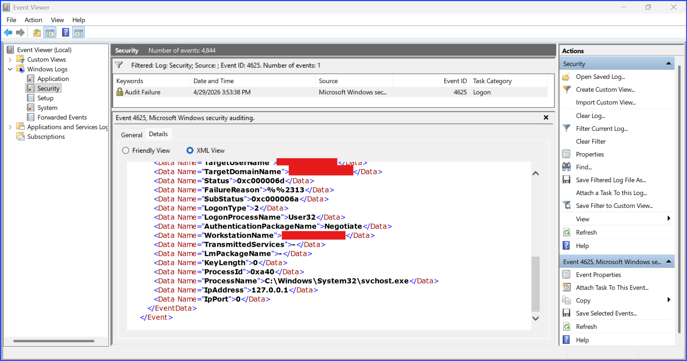
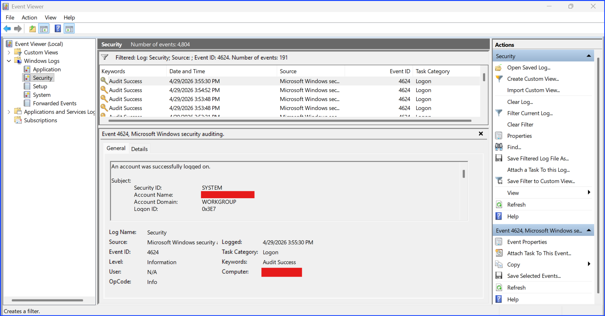
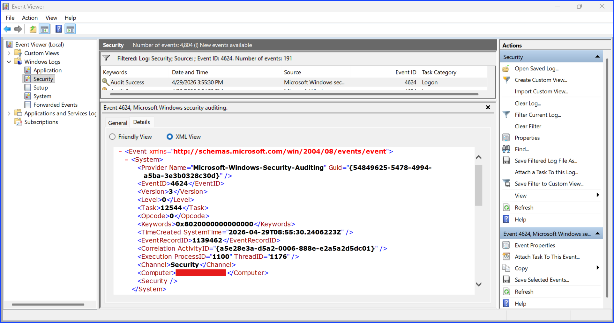
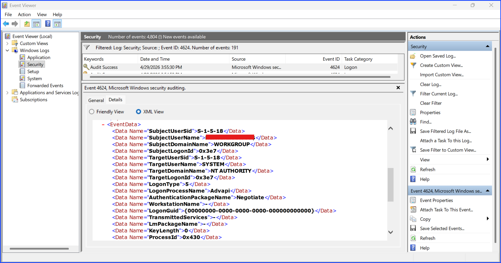
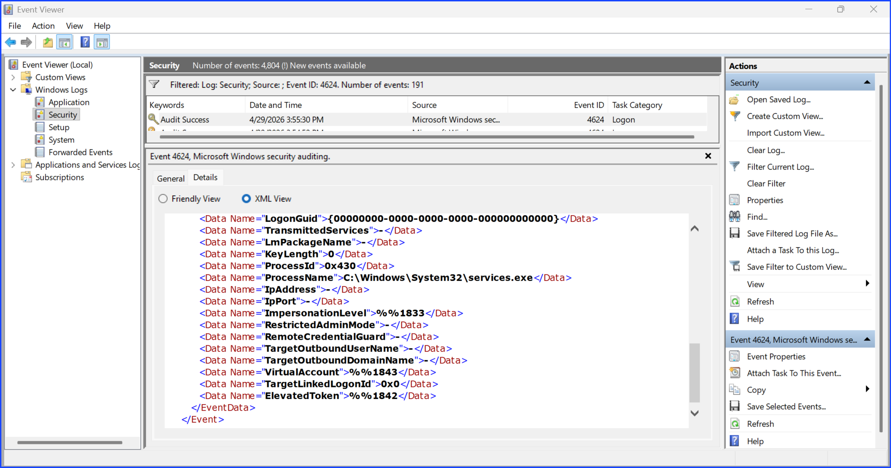

# Investigating Windows Event IDs 4624/4625: Successful and Failed Logon Attempts

## Context

This lab investigates successful and failed logon events on a Windows endpoint using Windows Event Viewer.

Logon success and failure events are important from a security perspective because multiple failed logons, such as 500 failures followed by one success, may indicate brute-force or password-guessing attempts by an attacker. A small number of failures might indicate that a normal user mistyped or forgot their credentials. However, these are only possible interpretations. A small number of failures does not guarantee that the activity was caused by a normal user. The timing and frequency of the events also matter.

The focus of this investigation is Windows Event ID 4624, which records a successful logon, and Event ID 4625, which records a failed logon.

The objectives of this investigation are to:

+ identify a trace of a failed logon.
+ extract relevant information from the event records.
+ determine whether the captured Event IDs 4625 and 4624 represent the same logon activity.

## Proof Of Concept

**Step 1.** Log out from my computer.
**Step 2.** Attempt to log back in while intentionally entering the wrong password. This triggers one failed-logon event, Event ID 4625.

Fig 1. Event ID 4625 General Tab

Fig 2. Event ID 4625 XML View -- System

Fig 3. Event ID 4625 XML View -- EventData 1

Fig 4. Event ID 4625 XML View -- EventData 2

**Step 3.** Log back in using the correct password. This should trigger a successful-logon event, Event ID 4624.

A nearby Event ID 4624 was selected for examination. Later field analysis showed that the captured Event ID 4624 was a service logon rather than the corresponding successful interactive logon from this step. The event was retained so its fields could be compared with the captured Event ID 4625.

Fig 5. Event ID 4624 General Tab

Fig 6. Event ID 4624 XML View -- System

Fig 7. Event ID 4624 XML View -- EventData 1

Fig 8. Event ID 4624 XML View -- EventData 2

**Step 4.** Review and extract the relevant details from both event records.

### Event ID 4625 Logon Failure Detail Extracted

#### Event ID 4625 System section

| Field Name | What it records | Data |
| --- | --- | --- |
| EventID | The Windows event identifier. | `4625` |
| TimeCreated SystemTime | When the event was recorded. | `2026-04-29T08:53:38.2376170Z` — 29 April 2026, 3:53:38 PM local time |

#### Event ID 4625 EventData Section

| Field Name | What it records | Data |
| --- | --- | --- |
| TargetUserName | Account involved in the attempted logon. | Redacted |
| TargetDomainName | Local-computer or domain context of the account. | Redacted |
| Status | Main authentication failure status code. | `0xc000006d` |
| SubStatus | More specific authentication failure status code. | `0xc000006a` |
| LogonType | Type of logon being attempted. | `2` |
| LogonProcessName | Trusted Windows logon process used for the attempt. | `User32` |
| ProcessName | The executable that requested or initiated the logon. | `C:\Windows\System32\svchost.exe` |
| IpAddress | Source network address recorded by the event. | 127.0.0.1 |

### Event ID 4624 Logon Success Detail Extracted

#### Event ID 4624 System Section

| Field Name | What it records | Data |
| --- | --- | --- |
| EventID | The Windows event identifier. | `4624` |
| TimeCreated SystemTime | When the event was recorded. | `2026-04-29T08:55:30.2406223Z` — 29 April 2026, 3:55:30 PM local time |

#### Event ID 4624 EventData section

| Field Name | What it records | Data |
| --- | --- | --- |
| TargetUserName | Account for which the logon session was created. | `SYSTEM` |
| TargetDomainName | Local-computer or domain context of the account. | `NT AUTHORITY` |
| LogonType | Type of logon that occurred. | `5` |
| LogonProcessName | Trusted Windows logon process used for the attempt. | `Advapi` |
| ProcessName | The executable that requested or initiated the logon. | `C:\Windows\System32\services.exe` |
| IpAddress | Source network address recorded by the event. | `-` |

## Analysis

### Examine Event IDs

The goal of this lab is to compare the failed and successful logon events and determine whether they represent the same logon activity.

Event ID 4625 records a failed logon attempt, while Event ID 4624 records a successful logon.

### Examine The Timestamps

To compare the timestamps, I examined the system time recorded in both events.

The Event ID 4625 failed-logon attempt occurred on 29 April 2026 at 3:53:38 PM local time, while the Event ID 4624 successful logon occurred on 29 April 2026 at 3:55:30 PM local time.

Both events occurred on the same day, with Event ID 4624 appearing 1 minute and 52 seconds after Event ID 4625. The events occurred close enough together to make the comparison worth investigating.

However, timestamps alone are not enough to conclude that the successful logon was the result of entering the correct password after Event ID 4625. Event ID 4624 records different types of successful logons, not only local users signing into Windows. It can also record successful service logons. Therefore, it is important to examine the other fields before reaching a conclusion.

### Identify Accounts Involved

The relevant fields are `TargetUserName` and `TargetDomainName`.

For Event ID 4625, `TargetUserName` and `TargetDomainName` contained my local username and local device name. Both values were redacted.

Event ID 4624 recorded `SYSTEM` as the `TargetUserName` and `NT AUTHORITY` as the `TargetDomainName`.

`SYSTEM` and `NT AUTHORITY` are not two separate accounts:

`SYSTEM` is the target account name.
`NT AUTHORITY` is the authority or domain context of the account.

Together, they identify one Windows security principal.

If both events pointed to the same account, this would support a possible relationship between them, although it would not be enough to reach a conclusion without examining the other fields.

In this lab, the accounts were different. Event ID 4625 pointed to my local user account, while Event ID 4624 pointed to the built-in `NT AUTHORITY\SYSTEM` account. These values did not need to be redacted because they are standard Windows account values.

The different target accounts show that these events cannot be the failed and successful records of the same account logon attempt.

### Interpret The LogonType

Event ID 4625 recorded a `LogonType` of `2`, while Event ID 4624 recorded a `LogonType` of `5`.

`Logon Type 2` means Interactive. A user attempted to log on directly to the computer, which matches the activity performed during this lab.

`Logon Type 5` means Service. The Service Control Manager started a service.

These are not the same category of logon. This is one of the strongest pieces of evidence that the records represent different activities.

### Examine LogonProcessName

Event ID 4625 recorded `User32` as the `LogonProcessName`. This is consistent with Windows handling an interactive user logon attempt.

Event ID 4624 recorded `Advapi` as the `LogonProcessName`. This indicates that a different Windows logon mechanism was used.

Different values are a signal to investigate further. Matching values would make the events appear more consistent, but they would not prove that the events belong together.

In this case, `User32` versus `Advapi` supports the stronger differences already found in the target accounts and logon types.

### Examine ProcessName

The caller process associated with the failed logon request in Event ID 4625 was recorded in `ProcessName` as:

`C:\Windows\System32\svchost.exe`

This process was connected with the failed authentication request.

The caller process that requested the logon in Event ID 4624 was recorded as:

`C:\Windows\System32\services.exe`

This refers to Windows Service Control Manager activity.

The Event ID 4624 fields are internally consistent:

+ `SYSTEM`
+ `NT AUTHORITY`
+ `Logon Type 5`
+ `Advapi`
+ `services.exe`

Together, these fields identify Event ID 4624 as a successful service logon.

A successful service logon is different from a successful interactive logon performed directly by a user. However, Windows records both types of successful logons under Event ID 4624. Therefore, a nearby Event ID 4624 should not automatically be treated as the successful result of a preceding Event ID 4625.

The account, logon type, logon process, and caller process must be examined to determine whether Event ID 4624 records the expected user activity or an unrelated service logon.

### Examine The Source Address

Event ID 4625 recorded the source IP address as `127.0.0.1`. This is the `localhost` address, meaning the activity came from the same computer rather than another computer or a remote system.

Event ID 4624 did not record a source IP address. The value `-` means that the field was not populated for this event. It does not necessarily mean that no networking was involved.

### Read the Event ID 4625 Failure Codes

Event ID 4625 recorded the following values:

`Status`: `0xC000006D`
`SubStatus`: `0xC000006A`

Their meanings are:

`0xC000006D`: The logon failed because of a bad username or authentication information.
`0xC000006A`: The password was incorrect.

These fields are not present in Event ID 4624 because Event ID 4624 records a successful logon and therefore has no failure status to explain.

## Conclusion

I initially compared these events because they occurred close together. However, the results showed that:

+ the target accounts were different.
+ the logon types were different.
+ the logon processes were different.
+ the caller processes were different.

Two conclusions can be drawn from this comparison.

First, time alone is not enough to treat Event ID 4624 as the corresponding successful version of Event ID 4625.

Second, the captured Event IDs 4625 and 4624 are not the failed and successful records of the same logon attempt.

## Recommendation

+ Configure an appropriate account-lockout threshold and lockout duration for the environment. The policy should allow for reasonable user mistakes while limiting repeated password-guessing attempts. Avoid setting the threshold too low because attackers could deliberately lock legitimate users out of their accounts.
+ Use strong, unique passwords and avoid reusing the same password across different accounts. A password manager can help users create and store unique passwords.
+ Enable multi-factor authentication where available. Even if an attacker obtains the correct password, MFA can prevent them from completing the login without the additional authentication factor.

## MITRE ATT&CK Reference

The techniques below are relevant to the investigation of authentication failures. This controlled lab contains only one intentional failed logon and does not demonstrate an actual brute-force, password-guessing, or password-spraying attack.

| Technique ID | Name | Tactic | Relevance |
| --- | --- | --- | --- |
| T1110 | Brute Force | Credential Access | Repeated authentication failures may indicate brute-force activity when examined together with the targeted accounts, source addresses, timing, frequency, and logon types. |
| T1110.001 | Password Guessing | Credential Access | Repeated Event ID 4625 records against one account, particularly with an incorrect-password status, may indicate that multiple passwords are being guessed against that account. |
| T1110.003 | Password Spraying | Credential Access | A small number of failed attempts distributed across many accounts may indicate password spraying. A low failure count for each account does not automatically mean that the activity is benign. |

MITRE defines password guessing as repeatedly trying passwords against an account and password spraying as trying one password or a small password list across many accounts to reduce the risk of account lockout.

Relevant mitigations:

+ `M1036` — Account Use Policies
+ `M1027` — Password Policies
+ `M1032` — Multi-factor Authentication
