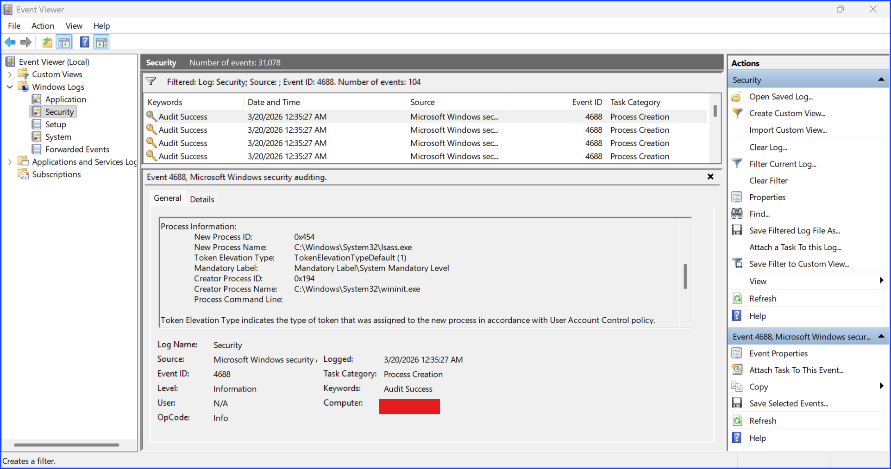
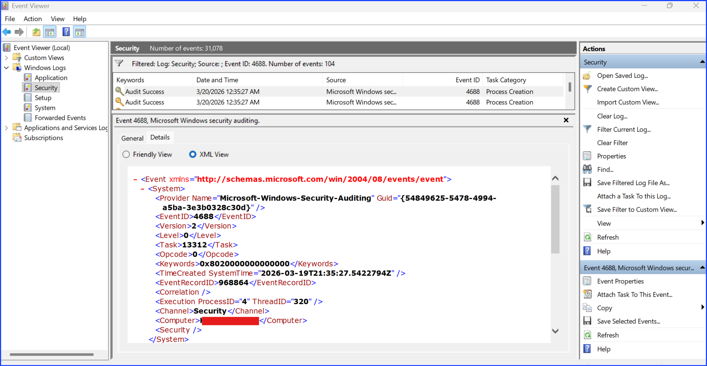
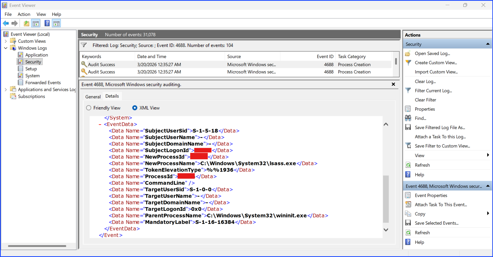

# Investigating Process Creation Using Event ID 4688

## Context

On a Windows OS, Event ID 4688 (Process Creation) allows an analyst to monitor:

+ Process execution tracking
+ Program and script execution visibility

Each time a process is created, it is recorded in this log. This enables analysts to review what has been executed on a machine and identify potentially suspicious activity.

Rather than immediately determining if a process is malicious, analysts use this data to identify unusual patterns and indicators, such as unexpected parent-child relationships, abnormal file paths, or irregular privilege usage. These indicators guide further investigation.

This approach supports early detection. Relying only on visible impact does not cover all attack types. For example:

+ Ransomware is highly visible due to system disruption
+ Data exfiltration may occur silently without obvious signs

By monitoring process creation events, analysts can detect suspicious behavior before significant damage occurs.

## Proof Of Concept

Open Windows Event View, filtered the current log, and search for event ID 4688.







## Analysis

### Inspecting The Process

The process name is `lsass.exe` which is a system process. The creator process name is `wininit.exe` which is another system process. This indicates that the investigated process is a child process of another system process. The reason that investigating the parent and child process is important is because in a normal situation the expected behavior is the expected system processes create expected child processes. If it is a malicious behavior, the process `lsass.exe` might be created by user process which can be the behavior of an attacker.

`wininit.exe` is the expected parent process that creates `lsass.exe`

### Checking File Path

Checking the paths, both are in `C:\Windows\System32` which is the usual system application path. Windows separates paths into system-protected paths and user-writable paths. An attacker needs a path with write and executed permission with or without administration privilege in order to create or run malicious files or process.

Paths with user-writable and execution without administration rights by default on Windows usually are

``` jsx

`C:\Users\`
`C:\Temp\`
`C:\AppData\`
```

These paths are attackers' initial target paths to download malicious files or create a process to run malicious files, run ordinary Windows binaries called Living Off The Land Binaries (LOLBins) with malicious attempts, exfiltration, or attempt privilege escalation. This is why an analyst should check the file path and use it as an indicator to do further investigation.

### Investigate The User

The next indicator to distinguish between a normal expected behavior and a malicious one is to check the user that runs the process.

Baseline SIDs and their meaning:

| SID | Meaning |
| --- | --- |
| `S-1-5-18` | SYSTEM |
| `S-1-5-19` | Local Service |
| `S-1-5-20` | Network Service |

Patterns recognition of `S-1-5-*`

`S` -> SID
`1` -> revision
`5` -> NT Authority

This tells me that an SID with this pattern is `S-1-5-*` is a Windows built-in system/authority account.

According to the evidence in the screenshot, the SID shown was `S-1-5-18`. It corresponds to the SYSTEM account. This means the process was executed under the SYSTEM account, which is expected behavior for a process like `lsass.exe`.

Malicious user indicator is regular user account creating the original process that supposed to be done by a system account. Then, they escalate their privilege to a system or administrator account to run the process.

### Investigating Privilege Escalation Attempt

According to the evidence in the screenshots

``` jsx
TokenElevationType = `%%1936` (default)
Integrity level = System (expected for `lsass.exe`)
```

Default token indicates no privilege elevation occurred. This showed the expected normal system behavior; therefore there is no privilege escalation attempt found.

## Conclusion

The observed process behavior aligns with expected Windows system activity. No indicators of compromise or privilege escalation were identified during this analysis.

## Recommendation

Continue monitoring process creation events for anomalies in parent-child relationships, file paths, and privilege usage.

## MITRE ATT&CK Reference

### Tactic: Execution

+ T1059 – Command and Scripting Interpreter
+ T1204 – User Execution
+ T1106 – Native API

### Additional Relevant Technique

+ T1036 – Masquerading

Event ID 4688 provides visibility into process creation, which supports detection of these techniques by allowing analysts to monitor process execution, parent-child relationships, and abnormal process behavior.
