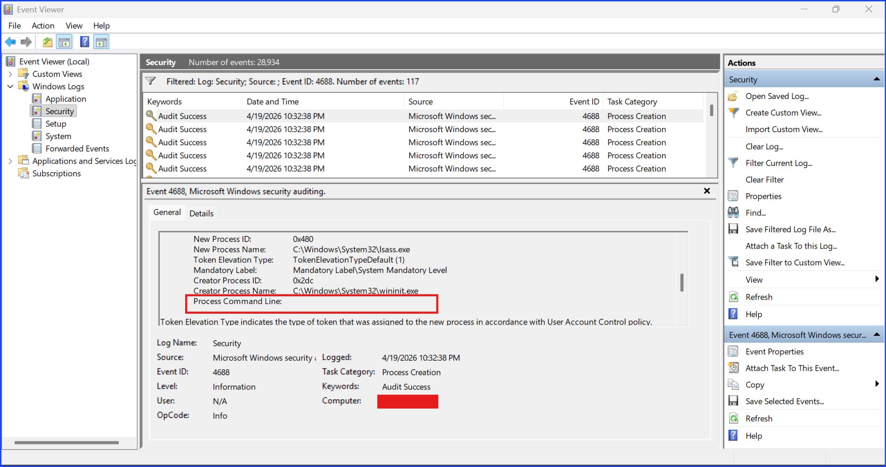
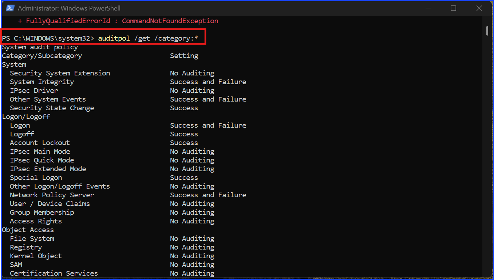
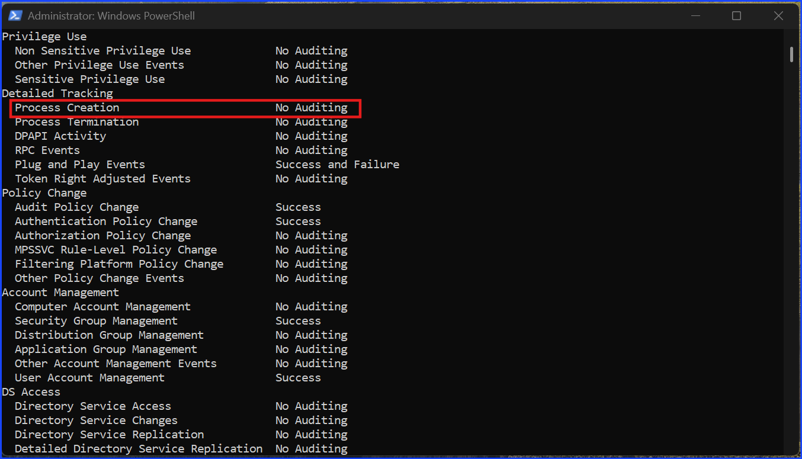
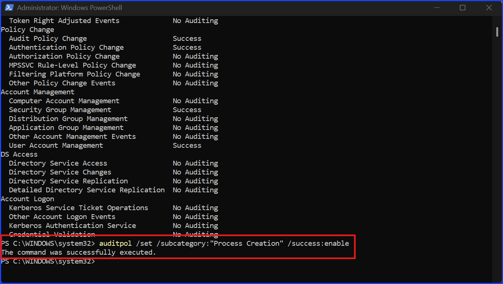
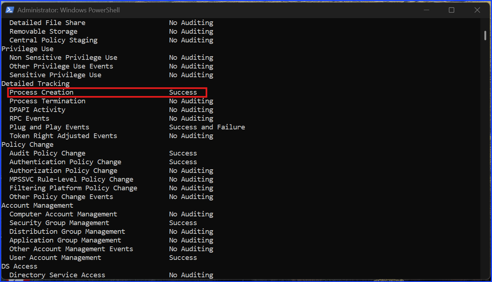
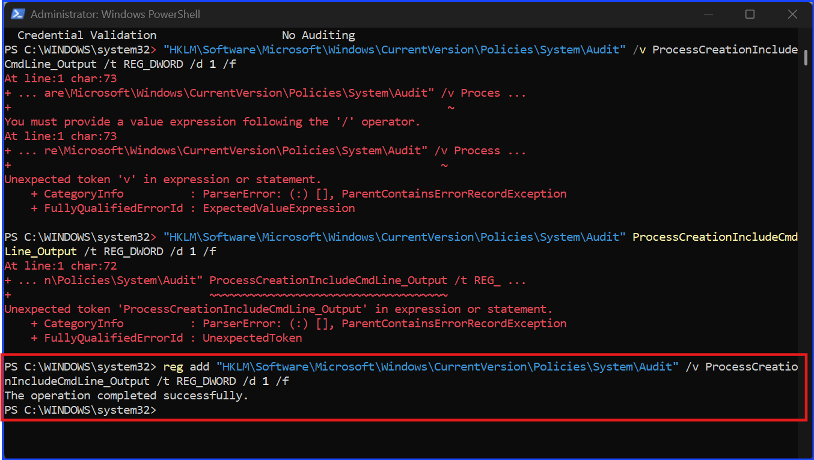

# Investigating Process Creation Using Event ID 4688

## Context

On a Windows OS, Event ID 4688 (Process Creation) allows an analyst to monitor:

+ Process execution tracking
+ Program and script execution visibility

Each time a process is created, it is recorded in this log. This enables analysts to review what has been executed on a machine and identify potentially suspicious activity.

Rather than immediately determining if a process is malicious, analysts use this data to identify unusual patterns and indicators, such as unexpected parent-child relationships, abnormal file paths, or irregular privilege usage. These indicators guide further investigation.

This approach supports early detection. Relying only on visible impact does not cover all attack types. For example:

+ Ransomware is highly visible due to system disruption
+ Data exfiltration may occur silently without obvious signs

By monitoring process creation events, analysts can detect suspicious behavior before significant damage occurs.

## Proof Of Concept

Open Windows Event View, filtered the current log, and search for event ID 4688.


Fig 1. Event ID 4688 General Tab.


Fig 2. Event ID 4688 Details Tab XML View System.


Fig 3. Event ID 4688 Details Tab XML View Event Data.

## Analysis

### Inspecting The Process

The process name is `lsass.exe` which is a system process. The creator process name is `wininit.exe` which is another system process. This indicates that the investigated process is a child process of another system process. The reason that investigating the parent and child process is important is because in a normal situation the expected behavior is the expected system processes create expected child processes. If it is a malicious behavior, the process `lsass.exe` might be created by user process which can be the behavior of an attacker.

`wininit.exe` is the expected parent process that creates `lsass.exe`

### Checking File Path

Checking the paths, both are in `C:\Windows\System32` which is the usual system application path. Windows separates paths into system-protected paths and user-writable paths. An attacker needs a path with write and executed permission with or without administration privilege in order to create or run malicious files or process.

Paths with user-writable and execution without administration rights by default on Windows usually are

``` jsx

`C:\Users\`
`C:\Temp\`
`C:\AppData\`
```

These paths are attackers' initial target paths to download malicious files or create a process to run malicious files, run ordinary Windows binaries called Living Off The Land Binaries (LOLBins) with malicious attempts, exfiltration, or attempt privilege escalation. This is why an analyst should check the file path and use it as an indicator to do further investigation.

### Investigate The User

The next indicator to distinguish between a normal expected behavior and a malicious one is to check the user that runs the process.

Baseline SIDs and their meaning:

| SID | Meaning |
| --- | --- |
| `S-1-5-18` | SYSTEM |
| `S-1-5-19` | Local Service |
| `S-1-5-20` | Network Service |

Patterns recognition of `S-1-5-*`

`S` -> SID
`1` -> revision
`5` -> NT Authority

This tells me that an SID with this pattern is `S-1-5-*` is a Windows built-in system/authority account.

According to the evidence in the screenshot, the SID shown was `S-1-5-18`. It corresponds to the SYSTEM account. This means the process was executed under the SYSTEM account, which is expected behavior for a process like `lsass.exe`.

Malicious user indicator is regular user account creating the original process that supposed to be done by a system account. Then, they escalate their privilege to a system or administrator account to run the process.

### Investigating Privilege Escalation Attempt

According to the evidence in the screenshots

``` jsx
TokenElevationType = `%%1936` (default)
Integrity level = System (expected for `lsass.exe`)
```

Default token indicates no privilege elevation occurred. This showed the expected normal system behavior; therefore there is no privilege escalation attempt found.

## Conclusion

The observed process behavior aligns with expected Windows system activity. No indicators of compromise or privilege escalation were identified during this analysis.

## Recommendation

Continue monitoring process creation events for anomalies in parent-child relationships, file paths, and privilege usage.

## MITRE ATT&CK Reference

### Tactic: Execution

+ T1059 – Command and Scripting Interpreter
+ T1204 – User Execution
+ T1106 – Native API

### Additional Relevant Technique

+ T1036 – Masquerading

Event ID 4688 provides visibility into process creation, which supports detection of these techniques by allowing analysts to monitor process execution, parent-child relationships, and abnormal process behavior.

## Note

The above was written based on my computer's default settings. It didn't log the `process commandline` field by default to save space. To make logs record more precise and useful for security professionals to investigate later, I have to manually **tell** Windows to log them. I will use `auditpol` which is a Windows native command for this task.

The idea is this command is like a toggle switch that I have to manually select which event IDs get the priority to be recorded more precisely. Otherwise, Windows will generate too many logs that will eat up the space. The decision of which event IDs should be manually logged extra precise is up to the security analyst to decide.



Fig 4. This is what display on Windows Event Viewer before turning the process logging on.

As you can see, the `Process Commandline` field's result is blank.

### The steps I toggle the `audipol` switch `on` for this event ID 4688

**Step 1.** Open `PowerShell` with `Administrator` privilege
**Step 2.** Run this command to see the current status of process logging: `auditpol /get /category:*`



Fig 5. Run the command `auditpol /get /category:*` to see the current process logging status on PowerShell.



Fig 6. Look at the specific subcategory that I am interested in which in this case is `Process Creation` and see `No auditing`.

**Step 3.** Run this command to turn on the process logging of event ID 4688: `auditpol /set /subcategory:"Process Creation" /success:enable`



Fig 7. Run the command to enable `Process Creation` logs.

**Step 4.** Run this command again to check the current status of process logging after I told it to log the Process Creation: `auditpol /get /category:*`. As you can see from the screenshot below, the `Process Creation` line changed from `No auditing` to `Success`.



Fig 8. Check the result after enable `Process Creation` logs using the command `auditpol /get /category:*` again and look for the change result from `No auditing` to `Success`.

**Step 5.** Enable Command Line Visibility

To ensure the actual text of the command is captured, I ran a command to update the Windows Registry. This tells the OS to include the command line arguments in the 4688 logs.

`reg add "HKLM\Software\Microsoft\Windows\CurrentVersion\Policies\System\Audit" /v ProcessCreationIncludeCmdLine_Output /t REG_DWORD /d 1 /f`

Without this step, Windows Event Viewer will still show a blank Commandline field, even if `auditpol` says `Success`.



Fig 9. Ensure that the actual commandline text is captured by adding it to Windows Registry.

### The result after I enable `auditpol` to log event ID 4688

**Due to the limitations of the local testing environment, the command line field remains a known visibility gap, highlighting the necessity for centralized policy management in an enterprise SOC.**

Now, take a look at the `Process Commandlines` field. You can see the actual commandline. This is what makes the two logs different. While a command like `help` may appear routine, having visibility allows an analyst to verify if the context of the command matches the expected user behavior because sometimes an attacker can rename `help.exe` to `help`. If the commandline shows something that is suspicious or dangerous, this is the evidence of a malicious attempt on the machine.

Here are some examples of suspicious or dangerous commands.

+ Adding a hidden user: `net user hacker Password123 /add`
+ Encoded PowerShell - classic attacker move: `powershell.exe -ExecutionPolicy Bypass -WindowStyle Hidden -EncodedCommand ...`

It is to be noted that in a small company or on an individual machine, this process is done manually on each machine. However, in a larger company, this process can be done easily when creating a `Policy` that pushes the same command to be effective on 10,000+ computers at once.

**Technical Observation:** While ProcessCreationIncludeCmdLine_Output was configured via the registry, the command line telemetry did not populate in this specific environment. This represents a Visibility Gap. In a production environment, this would be escalated to the Engineering team to ensure standardized Windows Enterprise/Pro builds are used to guarantee full forensic telemetry.

---

## CEU Submission Info

**Author:** Sangsongthong Chantaranothai
**Blog Title:** Investigating Process Creation Using Event ID 4688
**Blog URL:** [GitHub: Investigating Process Creation Using Event ID 4688](https://github.com/sangsongthong-hexterika/SOC-Analyst-Lab/blob/main/windows-investigation/event-ID-4688/event-id-4688-README.md)
**Date Published:** April 21, 2026
