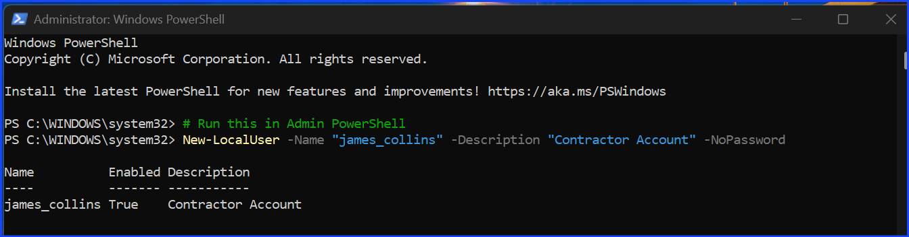
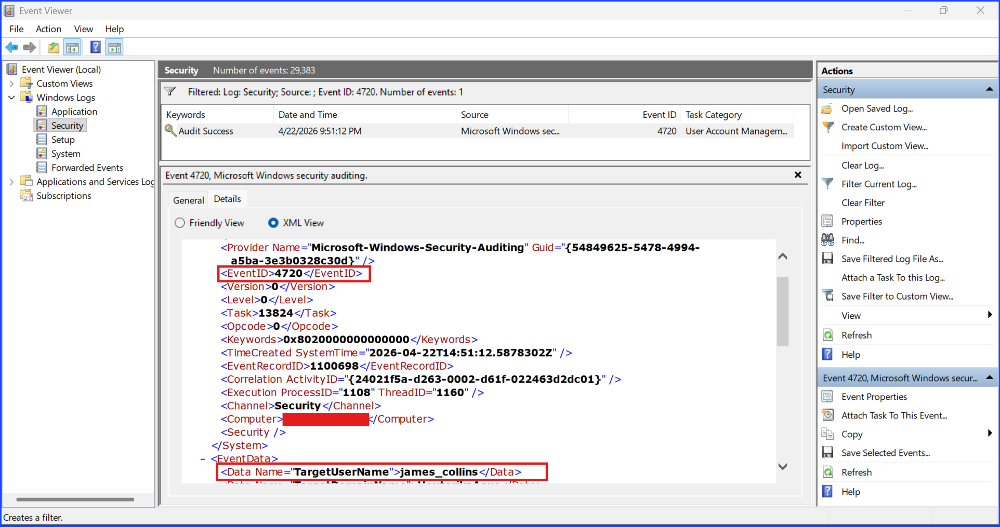
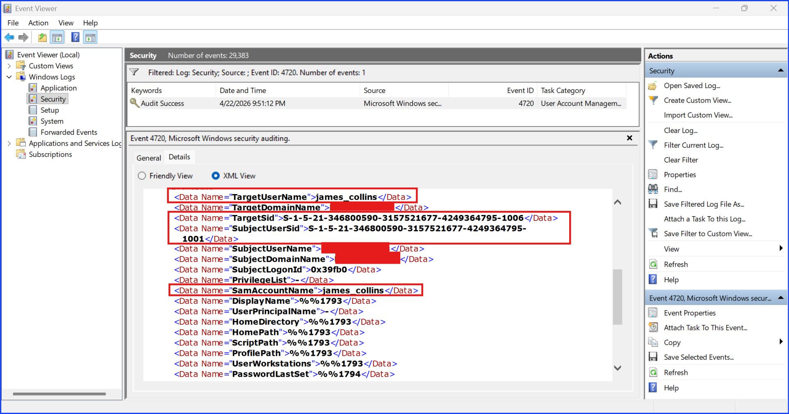
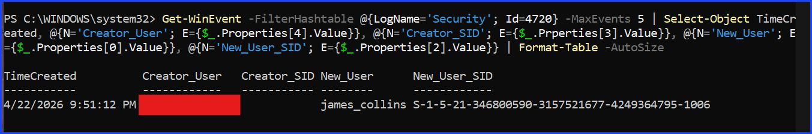
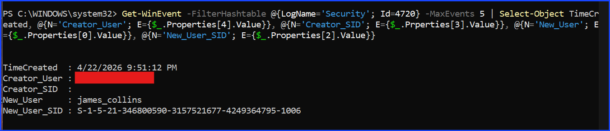

# Investigating Windows Event ID 4720: A New User Account Was Created

## Context

This lab investigates a new user account that was created on a Windows endpoint using Windows Event Viewer.

Creating a new user account events are important from a security perspective because an attacker frequently create a suspicous or malicious user after gaining the administrative rights to maintain persistence on the compromised systems to ensure they can still login event if their initial exploit is patched.

The focus of this investigation is Windows Event ID 4720, which records when a new user is created on a system.

The objectives of this investigation are to:

+ identify a trace of a new user being created event in Windows logs
+ extract relevant information from the event record
+ determine whether the activity represents a legitimate behavior performed by the authorized people or by an attacker

### Note

This investigation was conducted on my personal laptop as a controlled lab exercise. No active attack was present. The purpose of the investigation is to understand the baseline of a normal system behavior before without attacking it so when I start my controlled attack lab later, this is the baseline.

## Proof Of Concept

**Step 1.** Create a new account, James Collins. In this case, I use PowerShell instead of GUI for simplicity.

Fig 1. Creating a new user account. In this case, the sample name is `james_collins`.

**Step 2.** Searching for event ID 4720 log using Event Viewer with a PowerShell as a bonus.

Fig 2. XML-System

Fig 3. XML-EventData

Fig 4. powershell_win-event with table format

Fig 4. powershell_win-event without table format since it is the only 4720 event, I can use this format as well.

**Step 3.** Review event details

### Event Detail Extracted

| Field Name | Data |
| --- | --- |
| EventID | `4720` |
| ComputerName | My Username (redacted for privacy) |
| TargetUserName | `james_collins` (Sample Username - no need for redaction) |
| TargetSid | `S-1-5-21-...-1006` |
| SubjectSid | `S-1-5-21-...-1001` |
| PrivilegeList | `-` |
| SAM Account Name | `james_collins` |
| TimeCreated SystemTime | `22 April 2026 at 9:51:12 PM` |

## Analysis

Taking a look at the data from the Event Viewer XML, the criteria for analysis are:

| Field Name | What it tells me? | Why it is an indicator? |
| --- | --- | --- |
| SubjectUserSid | The person who clicked **Create**. | If a regular employee's account suddenly creates a new user, that employee's account is compromised. |
| TargetUserName | The name of the new user. | If it is something like `hacker101`, it will be easy to spot as a malicious account. However, an attacker can be stealthier by create a name that is like a normal person such as `james_collins`. As an analyst, we take in consideration to inspect this as well. If the company's naming convention is firstName_lastName, then, `james_collins` follows that pattern, but if it is firstName_firstInitialOfLastName, `james_c` is the correct structure and `james_collins` isn't. Moreover, an attacker can also create something like `local_admin` or `svc_backup` to try to mask their own presence in the system. |
| TargetSid | The unique ID of the new user. | Useful for tracking this user even if the attacker rename it later. |
| SAMAccountName | The actual login name. | Attackers might make the **Display Name** looks real but the **SAM Name** weird. |
| Privileges | What can this new user do? | Was it created as a standard user or added to the "Administrators" group immediately? |

### Inspecting The `TargetUserName`

Normally an analyst should compare it to the naming convention of the company's employee database naming convention and see if `james_collins` follows that structure or not.

Examples:

| Naming Structure | Sample |
| --- | --- |
| firstName_lastName | `james_collins` |
| firstName_lastNameInitial | `james_c` |
| firstNameInitial_lastName | `j_collins` |

Knowing this helps spotting a malicious attempt of a careless attacker if the name does not follow the company's guideline.

However, in this case, I created `james_collins` on my local computer for the lab purpose. I have full authority to do that so this is not a malicious attempt.

### Inspecting The `TargetUserSid`

The `TargetUserSid` for `james_collins` ends in RID `1006`.

Inspecting this field is useful because if the attacker set the `TargetUserName` to be something like `svc_backup` instead of `james_collins` but it has the `TargetUserSid` of `1006`, then, it shows a malicious attempt because this `1006` `TargetUserSid` in indicates it is a newly created custom account in the local security database which is differed from pre-existing system accounts.

### Inspecting The New User's Creator: `SubjectUserName`

According to the data extracted from this lab, the new user, `james_collins` was created by me, evidence by my own username that has been redacted, the `SubjectUserName`. I am authorized to created a new account on my own computer. I created this account and I remembered it. There is no malicious intent here.

### Inspecting The New User's Creator: `SubjectUserSid`

Inspecting my own account's `SubjectUserSid`. It shows it ends in RID `1001`. This identifier confirms that the account used to create the new user is the primary administrative account established during the system's initial setup. The use of a high-privilege RID (1000+) instead of a built-in system RID (e.g., 500) confirms this was a manual action performed by the local administrator which is me.

If this account was used in an irregular hour, a security analyst should contact the point of contact person or the local administrator who owns that account to validate if the action was malicious or not. If the local administrator was the one who perform the task at that time, it was non-malicious. Otherwise, we will have the evidence that the account is compromised.

### Inspecting Time Created

The user `james_collins` was created on `22 April 2026` at `9:51:12 PM`. The time created was outside of normal working hours.

This combines with an account with administrative privilege or an employee that should not have the authority to create a new user account such as a receptionist account can be an evidence to a malicious action.

However, in my case, I was the one with the authority to create a new user account and I did it on my own free will with a sound mind and sound body. Even if it happens outside the working hours, it is not a malicious action.

This means if the creator account belongs to someone with the authority to create a new user account create a new user account during the off-hours, the security analyst can just call in to verify if it is malicious or not because that person can work late. If that person has the authority to create a new user account, he can verify it. If he didn't perform the action, then it is clear that his account is compromised.

### Inspecting The Privilege Of The New User Account

It has a standard user privilege because the `PrivilegeList` field was `-`. There is nothing to worry about. If it is added into the admin group immediately after the creation, then, it can be a malicious intent evidence if there is no one name `james_collins` that supposes to have administrator privilege.

If the security analyst is unsure because the company outsource them, you can contact the company's contact person to verify this information to rule out malicious vs non-malicious actions.

### Inspecting `SAMAccountName`

There was nothing weird with the `SAMAccountName` either. It is the same as `TargetUserName`. This means there is no malicious intent here as well.

## Conclusion

There is no evidence of malicious attempt in the creation of this new user account. However, some indicator raises questionable alert that while it is not outright malicious action, it can be ambigous which can lead to further inspection such as an admin account creating a new user account during a non-working hour.

However, this questionable action can be rule out as malicious or non-malicious simply by contacting the point of contact person or that admin person directly to verify the action. This means beside technical inspection, communication also plays a major role in ruling out a malicious vs non-malicous action as well. A security analyst should take communication into their consideration and procedure as well before deciding if an action is malicious or non-malicious.

## Recommendation

To improve the detection and response for unauthorized account creation, the following measures are recommended:

+ **Enable Alerting for Event ID 4720:** Configure the SIEM or EDR to trigger a high-priority alert whenever a 4720 event occurs, especially if the SubjectUserSid does not match known IT/HR administrative accounts.

+ **Correlate with Group Membership Logs:** Ensure that Event ID 4732 is also being monitored. If a new user is created (4720) and immediately added to the "Administrators" or "Remote Desktop Users" group, it should be treated as a critical incident.

+ **Establish a Change Management Baseline:** Maintain a record of scheduled new hires or contractor start dates. Any 4720 event that does not align with a pre-approved change request should be automatically flagged for verification.

+ **Implement Least Privilege:** Ensure that standard user accounts do not have the permissions to create other accounts. Only designated "Account Operators" or "Domain Admins" should have this capability to reduce the "Subject SID" attack surface.

## MITRE ATT&CK Reference

The activity investigated in this lab maps to the following framework details:

| Tactic | Technique | ID | Detail |
| --- | --- | --- | --- |
| Persistence | Create Account | [T1136](https://attack.mitre.org/techniques/T1136/) | Attackers create new accounts to maintain access to a victim system even after their initial entry point is closed. |
| Persistence | Local Account | [T1136.001](https://attack.mitre.org/techniques/T1136/001/) | Specifically creating a local account (like james_collins) rather than a domain-wide account to stay under the radar of domain controllers. |

---

## CEU Submission Info

**Author:** Sangsongthong Chantaranothai  
**Blog Title:** Investigating Windows Event ID 4720: A New User Account Was Created  
**Blog URL:** [GitHub: Investigating Windows Event ID 4720: A New User Account Was Created](https://github.com/sangsongthong-hexterika/SOC-Analyst-Lab/blob/main/windows-investigation/event-ID-4720/event-id-4720-README.md)  
**Date Published:** April 23, 2026  
