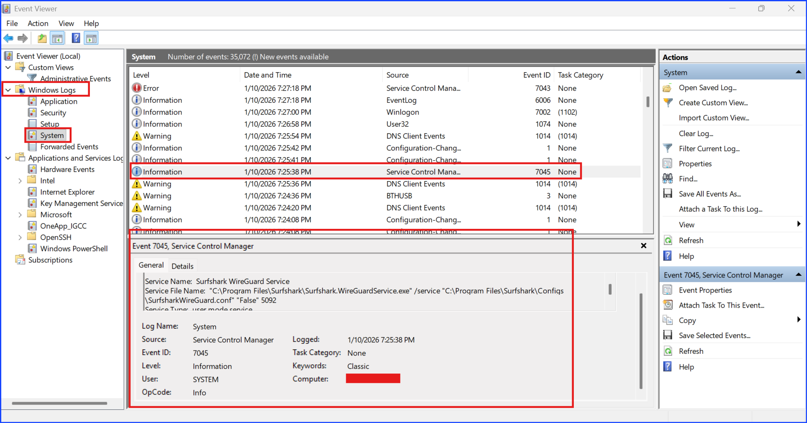
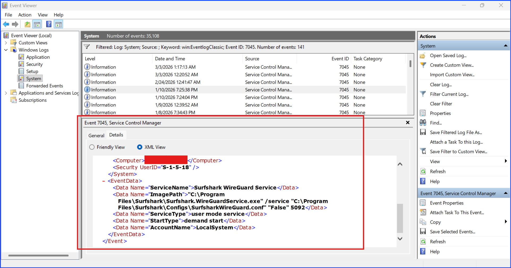
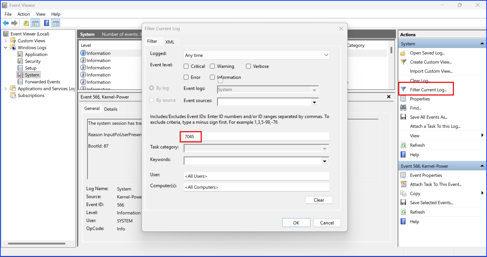

# Title

Investigating Service Installation Using Windows Event ID 7045

## Context

This lab investigates service installation events on a Windows endpoint using Windows Event Viewer.

Service creation events are important from a security perspective because attackers frequently install malicious services to maintain persistence on compromised systems.

The focus of this investigation is Windows Event ID 7045, which records when a new service is installed on a system.

The objectives of this investigation are to:

+ identify service installation events in Windows logs
+ extract relevant information from the event record
+ determine whether the activity represents legitimate software installation or suspicious behavior

### Note

This investigation was conducted on my personal laptop as a controlled lab exercise. No active attack was present. The purpose of the investigation is to demonstrate how a security analyst can review and interpret service installation events.

## Proof of Concepts

### Investigation Process

**Step 1** — Locate the Log Source

The investigation began by opening Windows Event Viewer, a built-in Windows tool used to review system and security logs.

The relevant logs are located under:

Windows Logs → System

This log contains events related to system activity, including service installation events.

**Step 2** — Search for Event ID 7045

An initial search was performed using the Find function `(Ctrl + F)` in Event Viewer.
The search keyword used was: `7045`

This allowed the system to locate events associated with service installation.

Screenshot – Event search result


Figure 1. SOC_EventID_7045_Surfshark_GeneralTab


Figure 2. SOC_EventID_7045_Surfshark_DetailsTab_friendlyView

**Step 3** — Refine the Search Using Log Filtering

Because multiple events can appear when using the search function, a more reliable approach was used by applying the Filter Current Log feature.

This method filters the log directly by event ID, reducing noise and making it easier to isolate relevant events.

Screenshot – Filter configuration


Figure 3. SOC_EventID_7045_Filter

**Step 4** — Review Event Details
After filtering the log, the relevant event entry was selected and reviewed.

The event details were examined in both the General view and the XML view to extract important information such as:

```service name
service file path
service account
service type
```

Screenshot – Event details


Figure 4. SOC_EventID_7045_Surfshark_DetailsTab_XML-view

The XML view provides the raw structured data of the event and allows analysts to verify the exact values recorded by the system.

### Event Details Extracted

Service Name: `Surfshark Wireguard Service`
Image Path: `C:\Program Files\...`
Service Account: `LocalSystem`
Service Type: `user mode service`

## Analysis

The Event ID 7045 entry indicates that a new Windows service was installed on the system.

Key indicators from the event log:

| Field | Value | Assessment |
| --- | --- | --- |
| Service Name | Surfshark Wireguard Service | Known VPN service |
| Image Path | `C:\Program Files\...` | Typical installation location |
| Account | LocalSystem | Common service execution account |
| Service Type | User-mode service | Normal behavior |

The service name corresponds to Surfshark VPN, a legitimate application.

The binary path is located inside the Program Files directory, which is the standard installation location for Windows applications.

Malicious services often install binaries in unusual locations such as:

```jsx
C:\Users\
C:\Temp\
C:\ProgramData\
```

Because this service originates from a known VPN application and uses a normal installation path, the activity is assessed as legitimate system behavior.

No indicators of compromise were identified in this event.

## Conclusion

This investigation confirmed that Windows Event ID 7045 records service installation activity on the system.

The analyzed event corresponds to the installation of the Surfshark WireGuard VPN service, which is legitimate software installed through a normal application process.

Although this specific event was benign, Event ID 7045 is important for security monitoring because attackers frequently install malicious services to establish persistence on compromised systems.

Monitoring service installation events can help security teams detect:

+ unauthorized service creation
+ persistence mechanisms used by malware
+ suspicious binaries executed as Windows services

## Recommendation

Security teams should review the following indicators when investigating Event ID 7045 events.

### Suspicious Service Names

Examples:

`svchost32`
`update_service`
`winupdatehelper`

### Unusual File Paths

Services installed outside standard directories should be treated with caution.

Examples:

`C:\Users\Public\`
`C:\Temp\`
`C:\ProgramData\`

Applications installed in the Program Files directory are more likely to be legitimate, but they should still be verified if the service name or behavior appears suspicious.

## MITRE ATT&CK Reference

```Technique: T1543.003 – Create or Modify
System Process: Windows Service```
